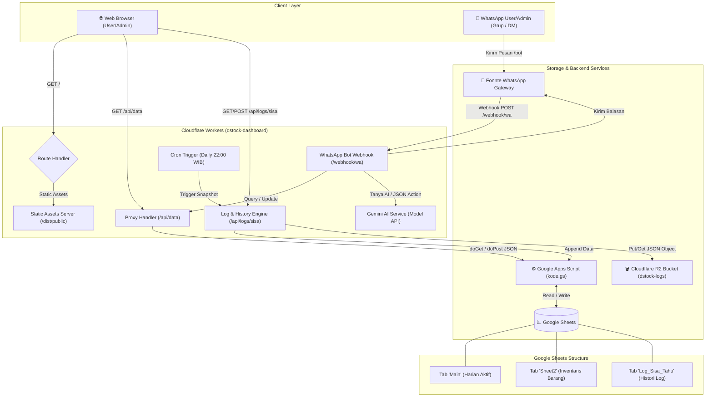
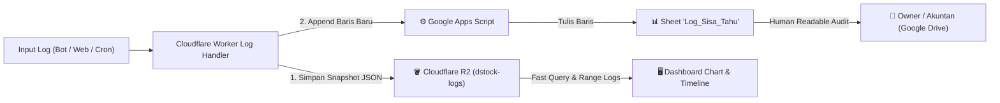
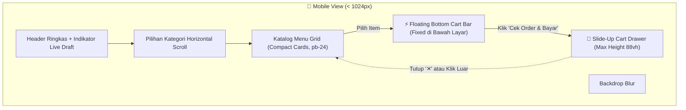

# 📄 Product Requirements Document (PRD)
## DStock – Tofu & Inventory Management System with Leftover Logging

---

| **Metadata** | **Detail** |
|---|---|
| **Project Name** | DStock (DB-Stock-Bot-Reminder) |
| **Domain Production** | `https://dstock.tahunyakrispiya.my.id/` |
| **Main Website** | `https://tahunyakrispiya.my.id/` |
| **Version** | `2.5.0` (Web POS Kasir Terintegrasi & Mode Cepat Foto QRIS) |
| **Status** | Active / Implemented |
| **Author / Owner** | Ramadnintya (@ramadani1t) |
| **Tech Stack** | Cloudflare Workers, Cloudflare R2, Google Apps Script (Zero Modified), Google Sheets, Tailwind CSS, DataTables, Chart.js, Fonnte WA Gateway, Google Gemini AI |

---

## 1. Executive Summary

**DStock** adalah sistem manajemen inventaris terintegrasi dan pelaporan operasional harian untuk usaha kuliner **Tahunya Krispi-ya!**. Sistem ini menghubungkan database Google Sheets dengan:
1. **Web Dashboard Real-Time**: Visualisasi stok bahan baku, target gorengan tahu harian, visual pill batch, dan generator laporan WhatsApp.
2. **Proxy API & Keamanan**: Cloudflare Worker yang memproteksi endpoint privat Google Apps Script (GAS) dan memblokir akses langsung browser.
3. **WhatsApp Bot Otomatis (Fonnte API)**: Bot interaktif grup/DM WhatsApp untuk cek stok, generate laporan, integrasi AI (Gemini), dan update stok langsung dari chat.
4. **Subsystem Pencatatan Log Sisa Tahu (Cloudflare R2)**: Penyimpanan riwayat log sisa tahu harian ke **Cloudflare R2 Storage** (`dstock-logs`) secara manual (via tombol modal dashboard dan bot `/bot catatsisa`), tanpa perlu mengubah script `kode.gs` Google Apps Script, sehingga histori sisa tahu tersimpan aman dan mudah dimonitor per tanggal.

---

## 2. Problem Statement & Background

### 2.1 Kondisi Saat Ini (Current State)
- Data operasional harian disimpan di Google Sheets pada tab `Main` (berisi baris tunggal untuk hari berjalan: *Tahu Mentah (Papan)*, *Tahu Tambahan (Pcs)*, *Gorengan Tahu Ini*, *Target Goreng*, *Pola Goreng*, *Sisa Tahu Hari Ini*, *Tahu Besok*).
- Setiap hari baru, operator/admin menimpa (overwrite) data di baris tersebut.
- Data inventaris barang pelengkap (kemasan, minyak, plastik, bumbu) disimpan di tab `Sheet2`.

### 2.2 Masalah yang Dihadapi (Pain Points)
1. **Kehilangan Rekam Jejak (Loss of Historical Data)**: Karena data pada sheet `Main` ditimpa setiap hari, pemilik bisnis kehilangan histori sisa tahu mentah maupun tahu matang per hari.
2. **Sulit Evaluasi & Prediksi**: Sulit menganalisis rata-rata sisa tahu per hari dalam 1 minggu/bulan, sehingga estimasi pembelian papan tahu untuk esok hari sering kali kurang presisi (rentan kekurangan bahan atau sisa terlalu banyak hingga basi).
3. **Keterbatasan Memori Operasional**: Sering lupa berapa sisa tahu kemarin jika sheet sudah terlanjur direset.

### 2.3 Solusi yang Diusulkan (Proposed Solution)
Membangun subsystem pencatatan otomatis & manual yang menyimpan snapshot log sisa tahu harian ke **Google Sheets (`Log_Sisa_Tahu`)** dan **Cloudflare R2 Storage (`dstock-logs/sisa-tahu/YYYY-MM-DD.json`)**, dilengkapi dengan:
- Perintah WhatsApp Bot: `/bot catatsisa` dan `/bot logsisa`.
- Fitur Snapshot Otomatis via Scheduler/Cron Worker & Google Apps Script Time-Trigger.
- Visualisasi grafik tren sisa tahu dan riwayat log pada Web Dashboard.

---

## 3. Arsitektur Sistem & Alur Data



---

## 4. Spesifikasi Fitur Eksisting (Baseline Features)

### 4.1 Web Dashboard (`index.html`)
- **Tabel Inventaris Real-Time**: Menggunakan DataTables dengan pencarian cepat, pengurutan, pagination, dan indikator status otomatis berdasarkan aturan kuantitas & satuan.
- **Kartu Ringkasan Metrik**: Total Item, Item Berstatus Aman, dan Item Berstatus Perlu Perhatian (Waspada + Bahaya).
- **Chart Status Inventaris**: Donut chart interaktif (Chart.js) menampilkan proporsi status stok Aman, Waspada, dan Bahaya.
- **Kalkulator & Status Target Tahu Harian**:
  - Menghitung kalkulasi tahu berbasis konstanta $1\text{ Papan} = 121\text{ pcs}$.
  - Menampilkan visual pill untuk status pola gorengan ($1, 2, 3, \dots$).
  - Membandingkan Tahu Hari Ini vs Rencana Tahu Besok.
- **WhatsApp Report Generator**: Preview format teks laporan lengkap dengan tombol salin instan (*Copy to Clipboard*) dan tombol muat ulang (*Regenerate*).

### 4.2 Logika Perhitungan & Rumus Bisnis Tahu (Tofu Business Logic)
1. **Konstanta Papan Tahu**:
   $$\text{Kapasitas per Papan} = 121\text{ pcs}$$
2. **Total Tahu Awal Hari Ini**:
   $$\text{Total Awal (pcs)} = (\text{Tahu Mentah (Papan)} \times 121) + \text{Tahu Tambahan (pcs)}$$
3. **Tahu Terjual / Terpakai**:
   - Jika kolom `Sisa Tahu Hari Ini (Pcs)` diisi manual di sheet:
     $$\text{Tahu Terpakai} = \text{Total Awal} - \text{Sisa Tahu}$$
   - Jika `Sisa Tahu Hari Ini (Pcs)` kosong:
     $$\text{Tahu Terpakai} = \sum_{i=1}^{\text{Current Gorengan}} \text{PolaGoreng}[i]$$
4. **Sisa Tahu Hari Ini**:
   $$\text{Sisa Tahu (pcs)} = \text{Total Awal} - \text{Tahu Terpakai}$$
5. **Indikator Ambang Batas (Threshold) Sisa Tahu**:
   - $\text{Sisa Tahu} \le 50\text{ pcs} \implies \textbf{Aman (🟢)}$ *(Habis/laris terjual, minim resiko makanan basi)*
   - $50 < \text{Sisa Tahu} \le 121\text{ pcs} \implies \textbf{Waspada (🟡)}$ *(Sisa sekitar 1 papan, perlu dioptimalkan esok)*
   - $\text{Sisa Tahu} > 121\text{ pcs} \implies \textbf{Bahaya (🔴)}$ *(Sisa banyak / 200an pcs, resiko basi & kerugian tinggi)*
6. **Perkiraan Total Tahu Besok**:
   $$\text{Total Besok (pcs)} = (\text{Tahu Besok (Papan)} \times 121) + \text{Sisa Tahu Hari Ini}$$

### 4.3 Ambang Batas Stok Barang Inventaris (`RULES`)
| ID / Satuan | Kategori Unit | Bahaya ($\le$) | Waspada ($\le$) | Aman ($>$) |
|---|---|---|---|---|
| `PAC1` | pack | $\le 1$ | $\le 3$ | $> 3$ (Aman $\ge 5$) |
| `PAC2` | pack | $\le 2$ | $\le 5$ | $> 5$ (Aman $\ge 10$) |
| `PAC3` | pack | $\le 2$ | $\le 4$ | $> 4$ (Aman $\ge 7$) |
| `pack` (default) | pack | $\le 0$ | $\le 1$ | $\ge 2$ |
| `kantong` | kantong | $\le 0$ | $\le 1$ | $\ge 2$ |
| `ml` | mililiter | $\le 30$ | $\le 90$ | $\ge 200$ |
| `sheets` | lembar | $\le 30$ | $\le 40$ | $\ge 80$ |
| `pcs` | pieces | $\le 10$ | $\le 20$ | $\ge 30$ |

*Aturan Khusus Khusus Heuristik Nama Barang:*
- *Kardus Size L*: Stok $\le 6 \implies \text{Bahaya}$
- *Thinwall*: Stok $1 - 4 \implies \text{Waspada}$
- *Kardus Size M*: Stok $1 - 12 \implies \text{Waspada}$
- *Plastik Sampah / Pagoda*: Stok $\le 1 \implies \text{Waspada}$

### 4.4 Cloudflare Worker Proxy & Keamanan (`src/index.js`)
- **Proteksi Akses Direct Browser**: Memeriksa header `Sec-Fetch-Mode: navigate` atau `Sec-Fetch-Dest: document` pada endpoint `/api/data`. Mengembalikan halaman HTML 403 kustom dengan countdown redirect jika dibuka langsung via address bar browser.
- **Proxy ke Google Apps Script**: Mencegah eksposur URL internal GAS di client-side.
- **Routing Webhook Fonnte**: Menerima request POST di `/webhook/wa` dengan verifikasi opsional `?secret=...`.

### 4.5 WhatsApp Bot (`/bot`) Commands
| Command | Akses | Parameter | Deskripsi |
|---|---|---|---|
| `/bot help` | Publik / Grup | - | Menampilkan daftar seluruh perintah yang tersedia |
| `/bot stok` | Publik / Grup | `[filter opsional]` | Menampilkan seluruh stok atau filter nama/ID tertentu |
| `/bot ringkasan` | Publik / Grup | - | Menampilkan informasi gorengan & target tahu hari ini |
| `/bot laporan` | Publik / Grup | - | Menghasilkan laporan stok lengkap siap kirim |
| `/bot ai` | Publik / Grup | `[pertanyaan]` | Konsultasi inventaris cerdas via Gemini AI |
| `/bot update` | Admin Whitelist | `[ID/Nama] [Jumlah]` | Mengubah stok barang di `Sheet2` secara instan |

---

## 5. Spesifikasi Lengkap: Fitur Baru Log Sisa Tahu (Leftover Tofu Logging Subsystem)

### 5.1 Tujuan & Sasaran Fitur
1. **Preservasi Data (Zero Data Loss)**: Menyimpan snapshot berkala harian ke Google Sheets dan Cloudflare R2.
2. **Monitoring Riwayat Multi-Platform**: Membaca histori data sisa tahu dari Web Dashboard maupun chat WhatsApp.
3. **Analisis Efisiensi & Rekomendasi**: Menghitung rata-rata sisa per hari kerja vs akhir pekan untuk optimasi belanja bahan mentah.

---

### 5.2 Skema Data (Data Model & Schema)

Setiap entitas log sisa tahu disimpan dalam struktur data JSON berikut:

```typescript
interface TofuDailyLog {
  id: string;                    // Format: "LOG-YYYYMMDD" atau "YYYY-MM-DD"
  date: string;                  // Format: "YYYY-MM-DD" (WIB Asia/Jakarta)
  timestamp: string;             // ISO 8601 String ("2026-09-02T22:00:00.000+07:00")
  input_source: "manual_bot" | "manual_dashboard" | "cron_auto" | "gas_trigger";
  recorded_by: string;           // Nomor WA / Username admin / "System Scheduler"
  
  // Data Pembelian & Awal
  papan_awal: number;            // Contoh: 3 (Papan)
  tahu_mentah_pcs: number;       // Contoh: 363 (3 * 121)
  tahu_tambahan_pcs: number;     // Contoh: 20
  total_tahu_awal_pcs: number;   // Contoh: 383

  // Data Produksi / Penggorengan
  target_goreng: number;         // Contoh: 10
  gorengan_selesai: number;      // Contoh: 8
  pola_goreng_raw: string;       // Contoh: "40, 40, 40, 40, 35, 35, 35, 35, -, -"
  tahu_terjual_pcs: number;      // Contoh: 300

  // Data Sisa & Evaluasi
  sisa_tahu_pcs: number;         // Contoh: 83
  sisa_status: "Aman" | "Waspada" | "Bahaya"; // Sesuai threshold
  
  // Perencanaan Esok Hari
  papan_besok: number;           // Contoh: 2 (Papan)
  total_besok_pcs: number;       // Contoh: 325 ((2 * 121) + 83)
  
  // Catatan Tambahan
  notes?: string;                // Contoh: "Hujan deras di sore hari, penjualan agak menurun"
}
```

---

### 5.3 Opsi Penyimpanan: Cloudflare R2 vs Google Sheets

Sistem mengadopsi **Dual-Storage Strategy (Penyimpanan Ganda)**:



#### Komparasi Arsitektur Penyimpanan:
| Parameter | Cloudflare R2 | Google Sheets (`Log_Sisa_Tahu`) |
|---|---|---|
| **Kegunaan Utama** | Database JSON permanen & cepat dibaca Worker/Dashboard | Audit visual langsung oleh manusia di Google Drive |
| **Lokasi Simpan** | Bucket: `dstock-logs/sisa-tahu/YYYY/MM/YYYY-MM-DD.json` | Tab: `Log_Sisa_Tahu` pada Spreadsheet aktif |
| **Kecepatan Baca** | Sangat Cepat (< 50ms di edge) | Relatif Lambat (bergantung latency Apps Script 500ms-1.5s) |
| **Kapasitas & Batasan** | Unlimited (Gratis 10GB/bulan, tanpa kuota request ketat) | Max 10 juta sel (sangat cukup untuk log harian puluhan tahun) |
| **Retensi Data** | Immutable Snapshot & Backup Historis | Dapat diedit manual jika ada koreksi data oleh owner |

---

### 5.4 Spesifikasi Tab Google Sheets (`Log_Sisa_Tahu`)

Struktur Kolom Header pada sheet `Log_Sisa_Tahu`:
| Kolom | Nama Header | Tipe Data | Contoh Nilai |
|---|---|---|---|
| **A** | Timestamp | Datetime | `2026-09-02 22:00:15` |
| **B** | Tanggal | Date | `2026-09-02` |
| **C** | Papan Awal | Number | `3` |
| **D** | Tahu Tambahan (Pcs) | Number | `20` |
| **E** | Total Awal (Pcs) | Number | `383` |
| **F** | Target Goreng | Number | `10` |
| **G** | Gorengan Selesai | Number | `8` |
| **H** | Pola Goreng | String | `40, 40, 40, 40, 35, 35, 35, 35` |
| **I** | Tahu Terjual (Pcs) | Number | `300` |
| **J** | Sisa Tahu (Pcs) | Number | `83` |
| **K** | Status Sisa | String | `Waspada` |
| **L** | Papan Besok | Number | `2` |
| **M** | Total Besok (Pcs) | Number | `325` |
| **N** | Pencatat / Sumber | String | `Bot WA (62812xxx)` |
| **O** | Catatan / Keterangan | String | `Hujan sore hari` |

---

### 5.5 Spesifikasi API Endpoint Log Baru

#### 1. `POST /api/logs/sisa` – Simpan Log Baru
- **Tujuan**: Menerima data payload sisa tahu dan menyimpannya ke R2 dan Google Sheets.
- **Request Headers**: `Content-Type: application/json`, `X-Admin-Secret: <TOKEN>` (jika dipanggil dari luar).
- **Request Body**:
  ```json
  {
    "date": "2026-09-02",
    "papan_awal": 3,
    "tahu_tambahan": 20,
    "target_goreng": 10,
    "gorengan_selesai": 8,
    "pola_goreng": "40, 40, 40, 40, 35, 35, 35, 35",
    "sisa_tahu": 83,
    "papan_besok": 2,
    "notes": "Penjualan normal",
    "source": "manual_dashboard",
    "recorded_by": "Admin Rama"
  }
  ```
- **Response Success (200 OK)**:
  ```json
  {
    "success": true,
    "message": "Log sisa tahu berhasil disimpan ke R2 dan Google Sheets",
    "log_id": "LOG-20260902",
    "saved_r2": true,
    "saved_sheets": true
  }
  ```

#### 2. `GET /api/logs/sisa` – Ambil Riwayat Log Sisa Tahu
- **Query Params**:
  - `days`: Jumlah hari terakhir (default: `7`, max: `90`).
  - `month`: Filter bulan tertentu (contoh: `2026-09`).
  - `limit`: Jumlah data per halaman.
- **Response (200 OK)**:
  ```json
  {
    "success": true,
    "count": 7,
    "data": [
      {
        "id": "LOG-20260902",
        "date": "2026-09-02",
        "total_tahu_awal_pcs": 383,
        "tahu_terjual_pcs": 300,
        "sisa_tahu_pcs": 83,
        "sisa_status": "Waspada",
        "papan_besok": 2,
        "total_besok_pcs": 325,
        "notes": "Penjualan normal"
      }
    ],
    "summary": {
      "avg_sisa_pcs": 65.4,
      "avg_terjual_pcs": 312.0,
      "total_hari_tercatat": 7
    }
  }
  ```

#### 3. `POST /api/logs/sisa/auto-snapshot` – Trigger Cron Snapshot
- Mengeksekusi penarikan data terkini dari sheet `Main`, menghitung kalkulasi sisa tahu secara otomatis, dan menyimpan entri log harian.

---

### 5.6 WhatsApp Bot Command Tambahan

#### 1. `/bot catatsisa` (Admin Only)
- **Sintaks**: `/bot catatsisa [sisa_pcs] [catatan opsional]`
- **Contoh**: `/bot catatsisa 45 Hujan deras mulai jam 5 sore`
- **Output Balasan**:
  ```text
  ✅ *Log Sisa Tahu Berhasil Disimpan!*
  ━━━━━━━━━━━━━━━━━━━
  📅 Tanggal     : Rabu, 02 Sep 2026
  🧊 Beli Awal   : 3 Papan + 20 pcs (Total 383 pcs)
  🔥 Terjual     : 338 pcs
  📉 Sisa Tahu   : *45 pcs* (🔴 Bahaya)
  🌅 Tahu Besok  : 2 Papan (Total 287 pcs)
  📝 Catatan     : Hujan deras mulai jam 5 sore
  👤 Pencatat    : 6285864917815
  ━━━━━━━━━━━━━━━━━━━
  💾 *Tersimpan di Google Sheets & Cloudflare R2*
  ```

#### 2. `/bot logsisa` (Publik / Grup)
- **Sintaks**: `/bot logsisa [jumlah_hari]`
- **Contoh**: `/bot logsisa 5`
- **Output Balasan**:
  ```text
  📊 *RIWAYAT SISA TAHU (5 Hari Terakhir)*
  ━━━━━━━━━━━━━━━━━━━
  • *02 Sep 2026*: Sisa *45 pcs* 🔴 | Terjual: 338 pcs
  • *01 Sep 2026*: Sisa *85 pcs* 🟡 | Terjual: 298 pcs
  • *31 Agu 2026*: Sisa *130 pcs* 🟢 | Terjual: 253 pcs
  • *30 Agu 2026*: Sisa *60 pcs* 🟡 | Terjual: 323 pcs
  • *29 Agu 2026*: Sisa *40 pcs* 🔴 | Terjual: 343 pcs
  ━━━━━━━━━━━━━━━━━━━
  📈 *Rata-rata Sisa*: 72 pcs / hari
  ```

---

### 5.7 UI/UX Dashboard Extension (Web Dashboard)

Pada halaman `index.html`, ditambahkan modul:
1. **Tombol "💾 Simpan Log Hari Ini"** pada kartu Status Target Tahu.
2. **Grafik Tren Riwayat Sisa Tahu (Chart.js Line Chart)**: Menampilkan garis perbandingan *Tahu Terjual* vs *Sisa Tahu* selama 7-30 hari terakhir.
3. **Tabel Riwayat Sisa Tahu**: Daftar tabel riwayat dengan filter tanggal dan badge status sisa.

---

## 6. Persyaratan Non-Fungsional (Non-Functional Requirements)

1. **Keandalan & Ketahanan (Reliability & Fault Tolerance)**:
   - Jika write ke Cloudflare R2 gagal, proses append ke Google Sheets tetap dijalankan (dan sebaliknya).
   - Error pada bot tidak boleh menghentikan serving static asset dashboard.
2. **Kinerja (Performance)**:
   - Response time pembacaan log dari Cloudflare R2 harus $< 100\text{ ms}$.
   - Response time WhatsApp Bot $< 3\text{ detik}$.
3. **Keamanan Data (Security & Privacy)**:
   - Akses update stok dan pencatatan log sisa dibatasi oleh nomor admin (`WA_ADMIN_NUMBERS`).
   - Kredensial sensitif (`GAS_URL`, `FONNTE_TOKEN`, `GEMINI_API_KEY`, `WEBHOOK_SECRET`) dikelola eksklusif melalui Cloudflare Worker Secrets.
4. **Skalabilitas**:
   - Penyimpanan R2 mampu menampung puluhan tahun data log tanpa penurunan performa kueri.

---

## 7. Roadmap & Rencana Implementasi

| Fase | Durasi | Target Deliverables |
|---|---|---|
| **Fase 1: Backend & Database** | Hari 1-2 | - Update `kode.gs` dengan handler `log_sisa_tahu` & pembacaan sheet `Log_Sisa_Tahu`<br>- Buat sheet `Log_Sisa_Tahu` di Google Sheets |
| **Fase 2: Cloudflare R2 & Worker API** | Hari 3-4 | - Binding R2 bucket `dstock-logs` di `wrangler.jsonc`<br>- Endpoint `POST /api/logs/sisa` dan `GET /api/logs/sisa`<br>- Cron Trigger snapshot harian |
| **Fase 3: WhatsApp Bot Interaction** | Hari 5 | - Handler `/bot catatsisa` dan `/bot logsisa`<br>- Update respon AI Gemini agar mengenali konteks histori sisa tahu |
| **Fase 4: Dashboard Visualization** | Hari 6-7 | - Chart tren sisa tahu di `index.html`<br>- Modal/Form simpan log sisa tahu di web |
| **Fase 5: Web POS Kasir (v2.5.0)** | Hari 8 | - Antarmuka Kasir POS `/pos` & `/kasir`<br>- Potong tahu mentah otomatis per porsi pesanan<br>- Mode Cepat QRIS (Foto Bukti Dulu $\to$ Pilih Menu)<br>- Struk Digital WhatsApp & Rekap Shift Harian |

---

## 8. Spesifikasi Fitur: Web POS Kasir (`pos.html`) – v2.5.0

### 8.1 Latar Belakang & Tujuan
Untuk mengoptimalkan efisiensi gerai **Tahunya Krispi-ya!**, kasir memerlukan aplikasi kasir (POS) yang ringan, cepat digunakan di perangkat mobile (smartphone kasir) maupun tablet/laptop kasir, serta terhubung langsung dengan kalkulasi stok tahu mentah dan sistem inventaris DStock.

### 8.2 Fitur Utama Web POS Kasir

#### 1. Mode Kilat QRIS ("Snap-First QRIS Mode")
- **Pain Point Lapangan**: Saat antrean panjang, pelanggan yang membayar QRIS sering kali lama menunggu kasir memilih menu terlebih dahulu sebelum menunjukkan QRIS, atau kasir lupa mencocokkan bukti bayar.
- **Solusi**: Kasir dapat memotret layar bukti transfer QRIS pembeli terlebih dahulu (kamera langsung atau unggah foto).
- **Proses**: Foto otomatis dikompresi menjadi format Base64 WebP/JPEG ringan, disimpan sebagai lampiran draft transaksi, lalu kasir memilih menu dalam hitungan detik.

#### 2. Integrasi Aplikasi QRISKas
- Mendukung integrasi nomor referensi transaksi dari aplikasi **QRISKas** (Nomor RRN / ID Transaksi QRISKas).
- Form input referensi QRISKas dilengkapi tombol pintas *Generate Ref* (contoh format: `QK-XXXXXX`) untuk mempermudah audit dan rekonsiliasi pembayaran non-tunai di akhir shift.
- Validasi status pembayaran QRIS tersimpan pada metadata transaksi.

#### 3. Sistem Draft Simulasi & Approval Center (Staging Persetujuan)
- **Aturan Keamanan Data**: Transaksi kasir **TIDAK langsung memotong sheet master Google Sheets (`Sheet2` / `Main`)**. Setiap transaksi kasir dikumpulkan terlebih dahulu sebagai **Draft Transaksi Simulasi** pada state lokal / Cloudflare Cache.
- **Simulasi Pemotongan Real-Time**: Kasir dan supervisor dapat melihat pergerakan simulasi stok secara instan:
  $$\text{Simulasi Sisa Tahu} = \text{Stok Awal Hari Ini} - \text{Total Tahu Terpotong Draft}$$
- **Persetujuan (Approval Action)**:
  - Supervisor / Owner memeriksa daftar draft terkumpul pada modal **Approval Staging Center**.
  - Terdapat ringkasan total nominal omzet, jumlah porsi, dan butir tahu mentah yang akan dipotong.
  - Setelah tombol **"Setujui & Potong Stok Master"** diklik, sistem memotong stok master secara resmi dan mencatat riwayat transaksi ke database.
  - Terdapat tombol opsi **"Reset Simulasi Saja"** jika transaksi hanya berupa latihan atau uji coba.

#### 4. Formula Pemotongan Tahu Master
Sesuai standar operasional bisnis Tahunya Krispi-ya!:
- $1\text{ Papan Tahu Mentah} = 121\text{ pcs}$.
- Setiap menu memiliki bobot `tofuPcs`:
  - **Porsi Mini**: $10\text{ pcs}$
  - **Porsi Reguler**: $15\text{ pcs}$
  - **Porsi Jumbo**: $25\text{ pcs}$
  - **Porsi Family**: $40\text{ pcs}$
  - Bumbu Tabur & Minuman: $0\text{ pcs}$ (tidak mengurangi tahu).
- Akumulasi pengurangan:
  $$\Delta \text{Tahu Mentah} = \sum (\text{Qty Item} \times \text{tofuPcs})$$

---

### 8.3 Desain Responsif & Prototipe Tata Letak Mobile (Mobile UX Specification)

Aplikasi Web POS Kasir dirancang dengan pendekatan **Mobile-First & Adaptive Layout**, memastikan kenyamanan operasional pada smartphone kasir:



#### Detail Komponen Tata Letak Mobile:
1. **Catalog Menu Grid (`pb-24 lg:pb-4`)**:
   - Area menu dioptimalkan satu kolom/dua kolom fleksibel dengan padding bawah ekstra agar kartu menu terbawah tidak tertutup oleh floating bar.
2. **Floating Bottom Cart Bar (`#mobileFloatingCartBar`)**:
   - Terpasang melayang (*fixed bottom*) pada perangkat mobile (`lg:hidden`).
   - Otomatis muncul ketika keranjang memiliki minimal 1 item (`totalItemCount > 0`).
   - Menampilkan total item, total nominal Rupiah, estimasi tahu terpotong, dan tombol aksi tegas *"Cek Order & Bayar"*.
3. **Slide-Up Mobile Cart Drawer (`.mobile-cart-drawer`)**:
   - Berupa panel geser ke atas (*slide-up sheet*) dengan tinggi maksimal `88vh` dan sudut membulat atas `rounded-t-3xl`.
   - Menggunakan `overflow-y-auto` dengan scroll mulus untuk review pesanan, pemilihan metode pembayaran (Tunai / QRISKas), input nominal uang pas/kembalian, serta tombol eksekusi transaksi.
   - Dilengkapi tombol tutup cepat `✕` di kanan atas dan `backdrop-blur` semi transparan.
4. **Desktop Layout (`lg:grid-cols-12`)**:
   - Pada layar laptop/tablet kasir ($\ge 1024\text{px}$), antarmuka bertransformasi menjadi split-view: 8 kolom katalog menu dan 4 kolom panel keranjang kasir permanen (*sticky sidebar*).

---

### 8.4 Struk Digital & Rekap Transaksi WhatsApp

- **Struk Thermal Digital**:
  - Tampilan struk ala mini-printer thermal monokrom modern.
  - Berisi identitas gerai, nomor nota, rincian item, metode bayar (QRISKas / Tunai), dan estimasi tahu terpotong.
  - Tombol **"Kirim Struk ke WhatsApp"**: Membuka API `https://wa.me/` dengan template pesan struk rapi dan ramah pelanggan.
- **Rekap Shift Transaksi Kasir**:
  - Modal riwayat transaksi dengan filter tanggal.
  - Rekapitulasi instan total omzet, pembagian omzet Tunai vs QRIS, serta total tahu mentah terpotong untuk dilaporkan ke grup koordinasi harian.

---

## 9. Verifikasi Pengujian & Hasil Visual Prototipe

### 9.1 Matrix Pengujian Fungsional & Responsivitas
| Komponen Diuji | Skenario Uji | Hasil Uji | Status |
|---|---|---|---|
| **Responsive Mobile Grid** | Buka viewport $390 \times 844\text{ px}$ pada `/pos` | Header, indikator live, dan kartu menu tampil rapi tanpa horizontal scroll | ✅ Lulus |
| **Floating Bottom Cart Bar** | Tambah 1x Porsi Reguler (15 pcs) | Floating bar muncul otomatis di bagian bawah dengan rincian Rp 15.000 & 15 pcs tahu | ✅ Lulus |
| **Slide-Up Drawer** | Klik *"Cek Order & Bayar"* pada floating bar | Drawer meluncur ke atas dari bawah layar tanpa lag atau console error | ✅ Lulus |
| **QRISKas Mode** | Pilih metode QRIS Kas & klik Generate Ref | Terbuat kode referensi otomatis `QK-XXXXXX`, input bukti bayar siap | ✅ Lulus |
| **Draft Simulasi** | Klik Simpan Transaksi | Masuk ke antrean draft simulasi, belum memotong Google Sheets master | ✅ Lulus |
| **Approval Center** | Buka modal persetujuan & klik *"Setujui & Potong Stok"* | Stok master terpotong, notifikasi toast sukses tampil, riwayat shift terupdate | ✅ Lulus |

### 9.2 Bukti Visual & Tangkapan Layar (Visual Artifacts)
- **Tampilan Katalog Mobile**: `pos_mobile_catalog_fresh_1789788141059.png`
- **Tampilan Floating Bottom Bar**: `pos_mobile_floating_bar_shown_1789788149866.png`
- **Tampilan Slide-Up Cart Drawer**: `pos_mobile_cart_drawer_open_1789788161116.png`
- **Video Interaksi Browser Mobile**: `mobile_pos_verified_1789788131751.webp`
- **Tampilan Desktop Initial**: `pos_initial_view_1789785697967.png`
- **Modal Draft Approval Staging**: `pos_draft_approval_modal_1789786687395.png`


